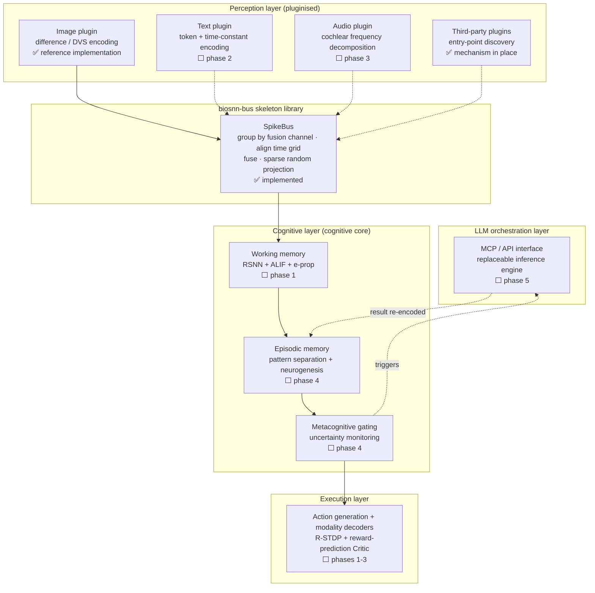

# BioSNN-Plug

**A biologically-plausible, fully multimodal spiking neural network cognitive prototype**

[中文](README.md) · [Project plan (Chinese)](BioSNN-Plug_项目计划书_v6.2.md) · [Plugin guide (Chinese)](docs/plugin_guide.md) · [ADRs (Chinese)](docs/adr/)

[](https://github.com/lzmd-arch/BioSNN-Plug/actions/workflows/ci.yml)
[](LICENSE)
[](https://www.python.org/downloads/)
[](https://colab.research.google.com/github/lzmd-arch/BioSNN-Plug/blob/main/examples/quickstart_register_plugin.ipynb)

> Most of this project's design documentation is written in Chinese, since that is the
> maintainer's working language. The code, docstrings of the public API, and this README
> are the English entry points. If you need a design document in English, please
> [open an issue](https://github.com/lzmd-arch/BioSNN-Plug/issues) — that is a real
> signal that someone outside the project needs it.

---

## What this is

A **research prototype** exploring one scientific question:

> **Can intelligence grow out of purely local learning rules, and learn to extend its own
> boundaries by calling on external reasoning?**

Concretely, three claims are under test:

1. **No surrogate gradients anywhere** — every synaptic update is driven by local signals
   (e-prop + kernelized IB-Hebbian + R-STDP), with no global backpropagation;
2. **Modality plugins** — text, image and audio attach to a shared cognitive core as
   independent plugins; adding a modality requires no change to the existing architecture;
3. **The SNN calls the LLM** — the SNN is the cognitive subject and decides *when to act*
   and *what to associate*; the LLM only decides *which action type to take and what
   content to generate*, sitting **inside** the SNN substrate as a replaceable
   inference engine.

## What this is not

**Not a production framework.** No SOTA-chasing, no availability guarantees, no team
behind it.

**Not "yet another multimodal SNN library".** Performance is not the goal. The point is to
test whether a high-risk route holds up — the project plan itself concedes the technical
risk here is higher than the alternative.

**Not a source of inspiration, a source of evidence.** Every claim is meant to be
reproducible from this public repository. Citations that could not be verified are marked
`unverified` rather than quietly presented as fact (see [docs/references.md](docs/references.md)).

## Status

| Part | Status |
| :--- | :--- |
| `biosnn-bus` skeleton library | **0.1.0, usable** — plugin interface, registry/discovery, spike-bus skeleton |
| Research code (e-prop / IB-Hebbian / R-STDP) | **Not started** — see the plan |
| Cognitive core, LLM orchestration | Not started |

The spike bus is currently a **skeleton**: dual-channel routing is in place, but the
default fusion strategy is plain concatenation — it is **not** the TAAF
temporal-attention-guided fusion described in the design document. That is a phase-2
research task. See [ADR-0001](docs/adr/ADR-0001-skeleton-as-separate-library.md).

## Architecture

Data flows bottom-up. ✅ marks what **already runs in this repository today**; ⬜ marks what
the project plan describes but has not been built. They are deliberately drawn on the same
diagram, because it doubles as the roadmap.



Every layer learns with **purely local** rules, never surrogate gradients: kernelized
IB-Hebbian + divisional normalization in perception, e-prop (Trace Propagation + ALIF) in
the cognitive core, R-STDP + a Critic in execution. Conflicts between the three rule
families are arbitrated by an ES meta-learned arbiter. See the project plan (Chinese) §2-3.

## Quickstart

`biosnn-bus` depends only on numpy and needs no GPU:

```bash
pip install biosnn-bus
```

A modality plugin is three methods and two properties:

```python
import numpy as np

from biosnn_bus import ModalityPlugin, PassThroughMembrane, SpikeBus, SpikeTrain


class LevelEncoder(ModalityPlugin):
    """Encode a 1-D signal as a population of spikes by level."""

    def __init__(self, spike_dim: int = 16) -> None:
        self._spike_dim = spike_dim
        self.levels = np.linspace(0.0, 1.0, spike_dim)

    @property
    def modality_name(self) -> str:
        return "level"

    @property
    def spike_dim(self) -> int:
        return self._spike_dim

    def encode(self, raw_input) -> SpikeTrain:
        signal = np.asarray(raw_input, dtype=np.float64).reshape(-1)
        radius = 0.5 / (self._spike_dim - 1)
        return SpikeTrain(data=np.abs(signal[:, None] - self.levels) <= radius)

    def get_membrane(self):
        return PassThroughMembrane()

    def decode(self, spike_output: SpikeTrain):
        return spike_output.data.astype(float) @ self.levels


bus = SpikeBus(bus_dim=64, seed=0)
bus.register(LevelEncoder())
output = bus.step({"level": np.linspace(0, 1, 12)})
print(output)
```

Or just open the [Colab notebook](https://colab.research.google.com/github/lzmd-arch/BioSNN-Plug/blob/main/examples/quickstart_register_plugin.ipynb)
(5 minutes, no GPU) — it draws the full spike raster from plugin to cognitive-core input.

## Repository layout

```text
packages/biosnn-bus/   The skeleton library: separately distributable, semver, depends on no research code
research/              Research code, filled in from phase 1; 12-month breaking-change grace period
examples/              Runnable examples; the script is the source of truth, the notebook is generated from it
docs/                  Plugin guide, ADRs, reproducibility checklist, references
scripts/               Checks used by CI and pre-commit
```

## Third-party plugins

You do **not** need to change a single line of this repository. Declare an entry point in
your own package:

```toml
[project.entry-points."biosnn_bus.plugins"]
audio = "my_pkg.plugins.audio:AudioPlugin"
```

Users then run `discover_plugins()` and `get_plugin("audio")`. See
[ADR-0003](docs/adr/ADR-0003-entry-point-plugin-discovery.md).

## Maintenance expectations

**One maintainer.** This is stated up front on purpose — managing expectations beats
pretending there is a team.

- **No SLA on issues.** Reports with a complete reproduction get priority.
- **`biosnn-bus` follows semver**, but is currently `0.x` — by semver convention, minor
  versions in `0.x` may contain breaking changes. The first release that someone else
  depends on will be `1.0.0`.
- **`research/` makes no compatibility promises for its first 12 months** (until 2027-09).

## License

- Code: [Apache-2.0](LICENSE)
- Documentation and the project plan: [CC-BY 4.0](https://creativecommons.org/licenses/by/4.0/)
- Datasets: under their respective licenses. This repository ships **no data mirrors**,
  only download and preprocessing scripts.

## Citation

If this project helps your research, please cite [CITATION.cff](CITATION.cff).
