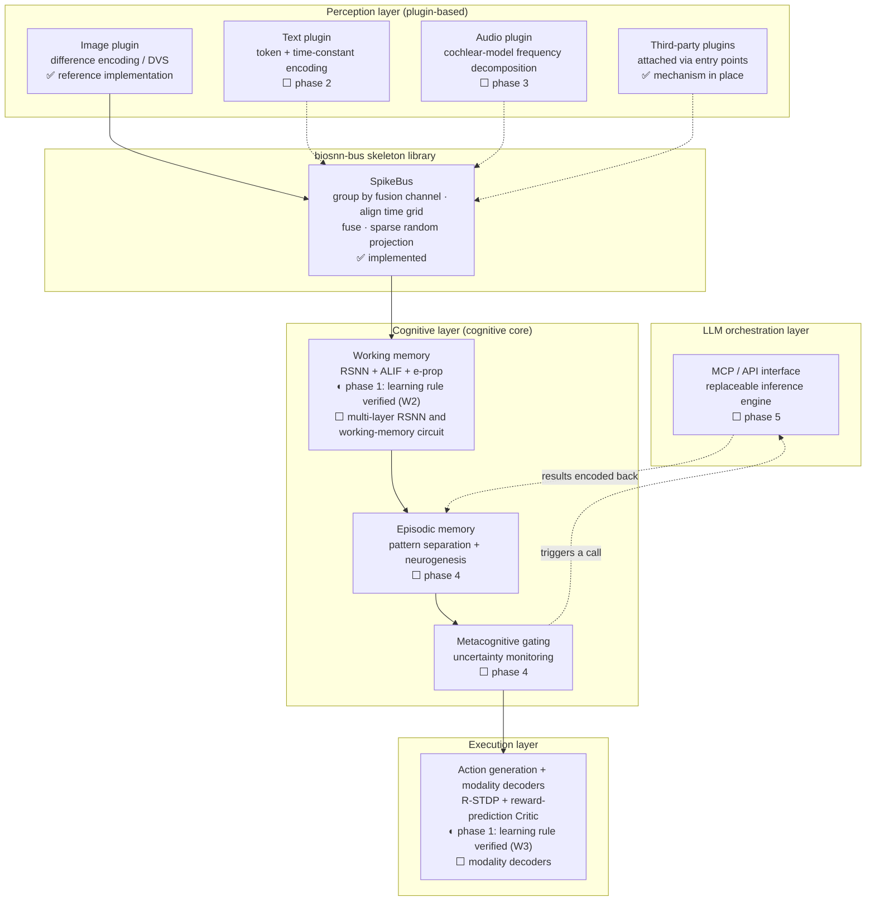

# BioSNN-Plug

**A biologically-plausible, fully multimodal spiking neural network cognitive prototype**

> **What is and isn't translated.** The documentation is available in Chinese, English and
> Japanese. The **code is not** — docstrings, inline comments and error messages are written
> in Chinese only, so a non-Chinese reader will still meet Chinese text when working with the
> library. The Japanese documentation is a machine-assisted translation that has not been
> reviewed by a native speaker; if something reads unnaturally, please open an issue.

[中文](README.md) · [日本語](README.ja.md) · [Project plan (Chinese)](BioSNN-Plug_项目计划书_v6.3.md) · [Plugin guide](docs/plugin_guide.en.md) · [Architecture decision records](docs/adr/README.en.md)

[](https://github.com/lzmd-arch/BioSNN-Plug/actions/workflows/ci.yml)
[](LICENSE)
[](https://www.python.org/downloads/)
[](https://colab.research.google.com/github/lzmd-arch/BioSNN-Plug/blob/main/examples/quickstart_register_plugin.en.ipynb)

## What this is

A research prototype testing one question: **can intelligence grow out of purely local
learning rules, and learn to extend its own boundaries by calling on external reasoning?**

Three claims are under test:

1. **No surrogate gradients** — every synaptic update is driven by local signals (kernelized IB-Hebbian in perception, e-prop in the cognitive core, R-STDP in execution);
2. **Modality plugins** — text, image and audio attach to a shared cognitive core as independent plugins; adding a modality requires no change to the existing architecture;
3. **The SNN calls the LLM autonomously** — the SNN is the cognitive subject and decides *when to act* and *what to associate*; the LLM is a replaceable inference engine responsible only for *what to generate*.

## What this is not

**Not a production framework.** No SOTA-chasing, no availability guarantees, one maintainer, no SLA on issues.

**Not a general SNN library.** Performance is not the goal; the point is to test whether a high-risk route holds up.

**Evidence, not inspiration.** Conclusions have to be reproducible from this repository; citations that cannot be verified are marked `unverified` (see the [reference list](docs/references.en.md)).

## Status

| Part | Status |
| :--- | :--- |
| `biosnn-bus` skeleton library | **0.1.0, usable** — plugin interface, registration and discovery, spike-bus skeleton |
| Research code: three verification lines | **Phase-1 implementations complete** — W1 Hebbian perception MNIST **97.79%** (default closed-form readout; SGD readout 98.01%) ✓; W2 e-prop sequential sMNIST **77.48%** (active neurons 1.0000) ✓; W3 R-STDP CartPole median **237.8 steps** (criterion ≥ 200) ✓. Numbers and provenance: [reproducibility record](docs/reproducibility.en.md) |
| Cognitive core / LLM orchestration | **Not started** — see the [project plan](BioSNN-Plug_项目计划书_v6.3.md) §7 |

Two boundaries worth stating plainly:

- The spike bus is a **skeleton**: dual-channel routing is in place, but the default fusion
  strategy is plain concatenation — **not** the TAAF temporal-attention-guided fusion described
  in §2.2 of the project plan. That is a phase-2 research task. (Why the skeleton library is a
  separate package, and why it deliberately includes none of these things, see
  [ADR-0001](docs/adr/ADR-0001-skeleton-as-separate-library.en.md).)
- The skeleton library is **not on PyPI yet**. `pip install biosnn-bus` only becomes usable once the `v0.1.0` tag is pushed (release channel in [release.yml](.github/workflows/release.yml)).

## Architecture

Data flows bottom-up. ✅ marks what already runs in this repository; ◐ marks a layer whose **single learning rule has been verified in phase 1** while the module as a whole (multi-layer network, modality decoders, working-memory circuit) is still unimplemented; ⬜ marks what the project plan describes but has not been started. All are on the same diagram because it doubles as the roadmap.



Conflicts between layers are arbitrated by an **ES meta-learning arbiter** (⬜ phase 2). The complete
description of each layer's learning rules is in the [project plan](BioSNN-Plug_项目计划书_v6.3.md) §2 and §3.

## Quickstart

Depends only on numpy, no GPU needed. Not on PyPI yet, so install from Git:

```bash
pip install "biosnn-bus @ git+https://github.com/lzmd-arch/BioSNN-Plug.git#subdirectory=packages/biosnn-bus"
```

A modality plugin is three methods and two properties:

```python
import numpy as np

from biosnn_bus import ModalityPlugin, PassThroughMembrane, SpikeBus, SpikeTrain


class LevelEncoder(ModalityPlugin):
    """Encode a one-dimensional signal as a population of spikes by level."""

    def __init__(self, spike_dim: int = 16) -> None:
        self._spike_dim = spike_dim
        self.levels = np.linspace(0.0, 1.0, spike_dim)

    @property
    def modality_name(self) -> str:
        return "level"

    @property
    def spike_dim(self) -> int:
        return self._spike_dim

    def encode(self, raw_input) -> SpikeTrain:
        signal = np.asarray(raw_input, dtype=np.float64).reshape(-1)
        radius = 0.5 / (self._spike_dim - 1)
        return SpikeTrain(data=np.abs(signal[:, None] - self.levels) <= radius)

    def get_membrane(self):
        return PassThroughMembrane()

    def decode(self, spike_output: SpikeTrain):
        return spike_output.data.astype(float) @ self.levels


bus = SpikeBus(bus_dim=64, seed=0)
bus.register(LevelEncoder())
output = bus.step({"level": np.linspace(0, 1, 12)})
print(output)
```

The [Colab demo](https://colab.research.google.com/github/lzmd-arch/BioSNN-Plug/blob/main/examples/quickstart_register_plugin.en.ipynb)
(5 minutes, no GPU) draws the full spike raster from the plugin to the input of the cognitive core.

Want a third-party package to ship a plugin? You **do not need to change a single line of this
repository** — see the [plugin guide](docs/plugin_guide.en.md#third-party-plugin-integration).

## Repository layout

```text
packages/biosnn-bus/   The skeleton library: an independent distribution package, follows semver, depends on no research code
research/              Research code: filled in from phase 1, 12-month breaking-change grace period
examples/              Runnable examples; the script is the single source of truth, the notebook is generated from it
docs/                  Plugin guide, ADRs, reproducibility checklist, reference list
scripts/               Checks used by CI and pre-commit
```

## Maintenance

One maintainer; reports with a complete reproduction get priority.

- `biosnn-bus` follows semver and is currently `0.x` — by convention, minor versions in `0.x` may contain breaking changes. The first version others depend on is bumped to `1.0.0`;
- code under `research/` makes no compatibility promises for its first 12 months (until 2027-09);
- third-party modality plugins can simply be their own packages; no PR to this repository is needed ([ADR-0003](docs/adr/ADR-0003-entry-point-plugin-discovery.en.md)).

## License and citation

Code [Apache-2.0](LICENSE); documentation and the project plan [CC-BY 4.0](https://creativecommons.org/licenses/by/4.0/). Datasets follow the license of each data source; this repository ships no data mirrors — the download and preprocessing script is [scripts/download_data.py](scripts/download_data.py).

**SpikingJelly, which the research lines depend on, uses the Open-Intelligence Open Source License 1.0 (OIOSL), not Apache-2.0.** Research use does not trigger it, but **commercial use or redistribution requires a disclosure filing with AITISA**. For the trade-off and its effect on the Python floor, see [ADR-0008](docs/adr/ADR-0008-spikingjelly-license-and-python-floor.en.md).

Cite via [CITATION.cff](CITATION.cff).
