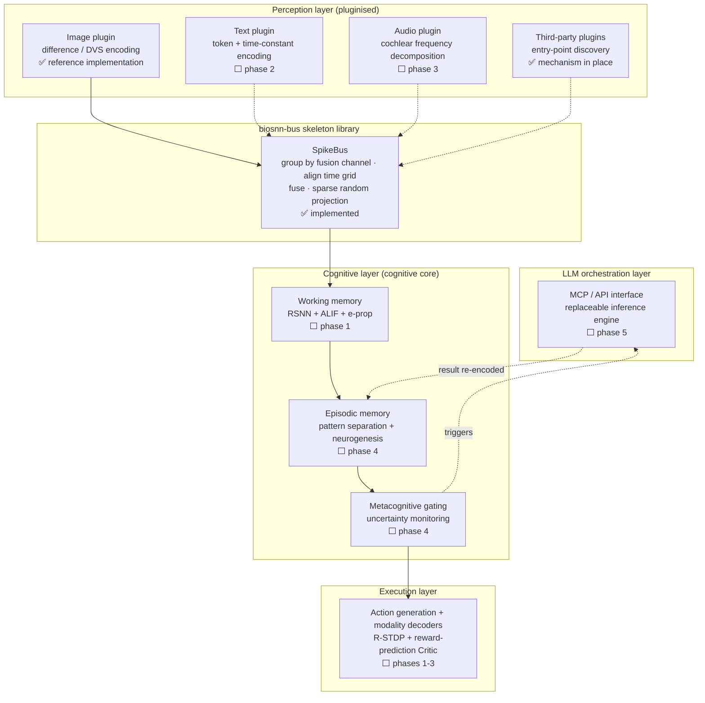

# BioSNN-Plug

**A biologically-plausible, fully multimodal spiking neural network cognitive prototype**

[中文](README.md) · [Project plan (Chinese)](BioSNN-Plug_项目计划书_v6.2.md) · [Plugin guide (Chinese)](docs/plugin_guide.md) · [ADRs (Chinese)](docs/adr/)

[](https://github.com/lzmd-arch/BioSNN-Plug/actions/workflows/ci.yml)
[](LICENSE)
[](https://www.python.org/downloads/)
[](https://colab.research.google.com/github/lzmd-arch/BioSNN-Plug/blob/main/examples/quickstart_register_plugin.ipynb)

> Design documentation is written in Chinese, the maintainer's working language. The code,
> the public-API docstrings, and this README are the English entry points. If you need a
> design document in English, [open an issue](https://github.com/lzmd-arch/BioSNN-Plug/issues).

## What this is

A research prototype testing one question: **can intelligence grow out of purely local
learning rules, and learn to extend its own boundaries by calling on external reasoning?**

Three claims are under test:

1. **No surrogate gradients** — every synaptic update is driven by local signals (kernelized IB-Hebbian in perception, e-prop in the cognitive core, R-STDP in execution);
2. **Modality plugins** — text, image and audio attach to a shared cognitive core as independent plugins; adding a modality requires no change to the existing architecture;
3. **The SNN calls the LLM** — the SNN is the cognitive subject and decides *when to act* and *what to associate*; the LLM is a replaceable inference engine that only decides *what to generate*.

## What this is not

**Not a production framework.** No SOTA-chasing, no availability guarantees, one maintainer, no SLA on issues.

**Not a general SNN library.** Performance is not the goal; the point is to test whether a high-risk route holds up.

**Evidence, not inspiration.** Every claim is meant to be reproducible from this repository; citations that could not be verified are marked `unverified` (see [references](docs/references.md)).

## Status

| Part | Status |
| :--- | :--- |
| `biosnn-bus` skeleton library | **0.1.0, usable** — plugin interface, registry/discovery, spike-bus skeleton |
| Research code / cognitive core / LLM orchestration | **Not started** — see [the plan](BioSNN-Plug_项目计划书_v6.2.md) |

Two boundaries worth stating plainly:

- The spike bus is a **skeleton**: dual-channel routing is in place, but the default fusion strategy is plain concatenation — **not** the TAAF temporal-attention-guided fusion described in the design document. That is a phase-2 research task ([ADR-0001](docs/adr/ADR-0001-skeleton-as-separate-library.md)).
- The skeleton library is **not on PyPI yet**. `pip install biosnn-bus` works once the `v0.1.0` tag is pushed (release pipeline in [release.yml](.github/workflows/release.yml)).

## Architecture

Data flows bottom-up. ✅ marks what already runs in this repository; ⬜ marks what the plan describes but has not been built. Both are on the same diagram because it doubles as the roadmap.



Conflicts between the three rule families are arbitrated by an **ES meta-learned arbiter** (⬜ phase 2). Full description in [the plan](BioSNN-Plug_项目计划书_v6.2.md) §2-3.

## Quickstart

Depends only on numpy, no GPU needed. Not on PyPI yet, so install from Git:

```bash
pip install "biosnn-bus @ git+https://github.com/lzmd-arch/BioSNN-Plug.git#subdirectory=packages/biosnn-bus"
```

A modality plugin is three methods and two properties:

```python
import numpy as np

from biosnn_bus import ModalityPlugin, PassThroughMembrane, SpikeBus, SpikeTrain


class LevelEncoder(ModalityPlugin):
    """Encode a 1-D signal as a population of spikes by level."""

    def __init__(self, spike_dim: int = 16) -> None:
        self._spike_dim = spike_dim
        self.levels = np.linspace(0.0, 1.0, spike_dim)

    @property
    def modality_name(self) -> str:
        return "level"

    @property
    def spike_dim(self) -> int:
        return self._spike_dim

    def encode(self, raw_input) -> SpikeTrain:
        signal = np.asarray(raw_input, dtype=np.float64).reshape(-1)
        radius = 0.5 / (self._spike_dim - 1)
        return SpikeTrain(data=np.abs(signal[:, None] - self.levels) <= radius)

    def get_membrane(self):
        return PassThroughMembrane()

    def decode(self, spike_output: SpikeTrain):
        return spike_output.data.astype(float) @ self.levels


bus = SpikeBus(bus_dim=64, seed=0)
bus.register(LevelEncoder())
output = bus.step({"level": np.linspace(0, 1, 12)})
print(output)
```

The [Colab notebook](https://colab.research.google.com/github/lzmd-arch/BioSNN-Plug/blob/main/examples/quickstart_register_plugin.ipynb)
(5 minutes, no GPU) draws the full spike raster from plugin to cognitive-core input.

Want a third-party package to ship a plugin? You **do not need to change a single line of
this repository** — see the [plugin guide](docs/plugin_guide.md#让第三方包提供插件).

## Repository layout

```text
packages/biosnn-bus/   The skeleton library: separately distributable, semver, depends on no research code
research/              Research code, filled in from phase 1; 12-month breaking-change grace period
examples/              Runnable examples; the script is the source of truth, the notebook is generated from it
docs/                  Plugin guide, ADRs, reproducibility checklist, references
scripts/               Checks used by CI and pre-commit
```

## Maintenance

One maintainer; reports with a complete reproduction get priority.

- `biosnn-bus` follows semver, currently `0.x` — by convention, minor versions in `0.x` may contain breaking changes. The first release someone else depends on will be `1.0.0`.
- `research/` makes no compatibility promises for its first 12 months (until 2027-09).
- Third-party modality plugins live in their own packages; no PR to this repository needed ([ADR-0003](docs/adr/ADR-0003-entry-point-plugin-discovery.md)).

## License and citation

Code [Apache-2.0](LICENSE); documentation and the project plan [CC-BY 4.0](https://creativecommons.org/licenses/by/4.0/). Datasets follow their own licenses — this repository ships no data mirrors; download and preprocessing scripts will ship with phase 1.

Cite via [CITATION.cff](CITATION.cff).
