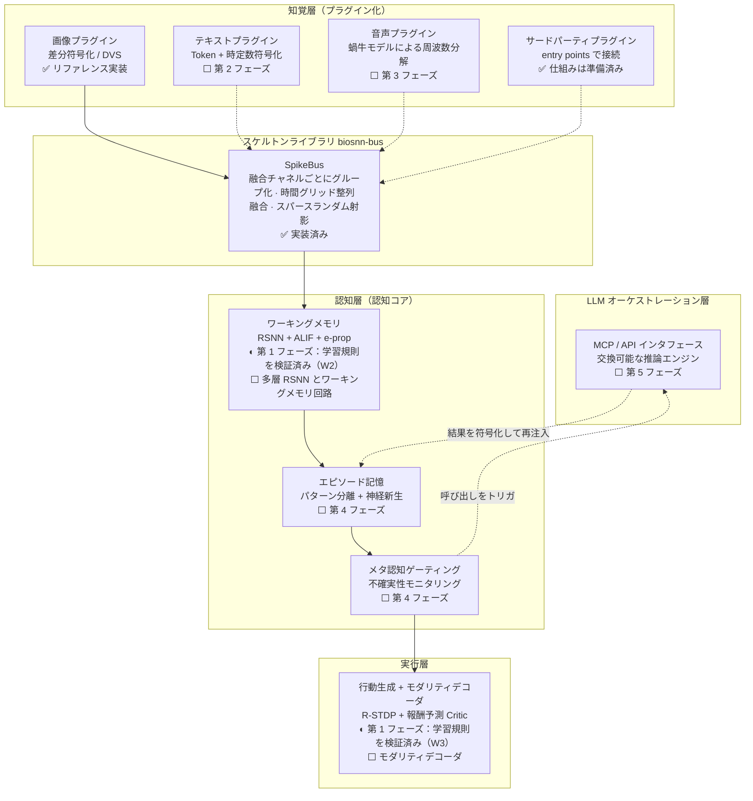

# BioSNN-Plug

**高い生物学的妥当性を志向した全モダリティ・スパイキングニューラルネットワーク認知プロトタイプ**

> **翻訳されている範囲について。** ドキュメントは中国語・英語・日本語で提供していますが、
> **コードは翻訳されていません**——docstring、コメント、エラーメッセージは中国語のみです。
> そのため非中国語話者がライブラリを使うと、中国語のテキストに触れることになります。
> また、この日本語版は機械支援による翻訳であり、母語話者によるレビューを受けていません。
> 不自然な箇所があれば issue でお知らせください。

[中文](README.md) · [English](README.en.md) · [プロジェクト計画書 v6.2](BioSNN-Plug_项目计划书_v6.2.md) · [v6.3（引用訂正版）](BioSNN-Plug_项目计划书_v6.3.md) · [プラグイン開発ガイド](docs/plugin_guide.ja.md) · [アーキテクチャ決定記録](docs/adr/README.ja.md)

> **二つの版の関係**：**v6.2 が正式なプロジェクト計画書**です。**v6.3** は最初の引用考証による訂正を反映した版です（変更点は [`docs/references.ja.md`](docs/references.ja.md) の「計画書本文の訂正待ち項目」にあります）。引用は v6.2 を、訂正後の表現（Trace Propagation の位置づけ、TD-LTP の出典など）が必要なときは v6.3 を使ってください。

[](https://github.com/lzmd-arch/BioSNN-Plug/actions/workflows/ci.yml)
[](LICENSE)
[](https://www.python.org/downloads/)
[](https://colab.research.google.com/github/lzmd-arch/BioSNN-Plug/blob/main/examples/quickstart_register_plugin.ja.ipynb)

## これは何か

研究プロトタイプであり、一つの問いを検証する：**知性は純粋に局所的な学習則から育つことができ、外部推論を借りて自らの境界を拡張することを学べるか？**

三つの具体的な主張：

1. **代理勾配をスキップする**——シナプス更新はすべて局所信号によって駆動される（知覚層はカーネル化 IB-Hebbian、認知層は e-prop、実行層は R-STDP）；
2. **モダリティのプラグイン化**——テキスト／画像／音声を独立したプラグインとして共有の認知コアに接続し、モダリティを追加しても既存のアーキテクチャを変更しない；
3. **SNN が自ら LLM を呼び出す**——SNN が認知主体であり、「いつ行動するか、何を関連づけるか」を決める；LLM は交換可能な推論エンジンとして「何を生成するか」だけを担う。

## これは何ではないか

**プロダクションフレームワークではない。** SOTA を目指さず、可用性も約束せず、メンテナは 1 名で、issue に SLA を設けない。

**汎用の SNN ライブラリではない。** 性能は目標ではなく、価値は高リスクな路線が成立するかどうかの検証にある。

**インスピレーションではなく証拠である。** 結論は本リポジトリで再現できなければならない；検証できなかった引用には正直に `unverified` を付ける（[引用リスト](docs/references.ja.md) 参照）。

## 現在の状態

| 部分 | 状態 |
| :--- | :--- |
| `biosnn-bus` スケルトンライブラリ | **0.1.0 利用可能**——プラグインインタフェース、レジストリとディスカバリ、スパイクバスの骨組み |
| 研究コード：三つの検証ライン | **第 1 フェーズの実装完了**——W1 Hebbian 知覚 MNIST **97.79%**（既定の閉形式解の読み出し；SGD 読み出しは 98.01%）✓；W2 e-prop 系列 sMNIST **77.48%**（活動ニューロン 1.0000）✓；W3 R-STDP CartPole 中央値 **237.8 歩**（基準 ≥ 200）✓。数値と再現記録は[再現記録](docs/reproducibility.ja.md) 参照 |
| **ネットワーク規模** | **スパイキングニューロン 256 個**（W2）。W1 には**レート型**ユニットが 3,072 個あります（スパイキングニューロンには数えません）。計画書 §2.2 の認知コア目標は約 5 万——**約 195 倍の差**。詳細は [research/README](research/README.ja.md) |
| 認知コア / LLM 連携 | **未着手**、[プロジェクト計画書 §七](BioSNN-Plug_项目计划书_v6.2.md) 参照 |

明確にしておくべき境界が 2 つある：

- スパイクバスは**骨組み**である：二重チャネルルーティングはすでに実装されているが、既定の融合戦略は単純連結であり、プロジェクト計画書 §2.2 が記述する TAAF 時間注意誘導融合では**ない**——それは第 2 フェーズの研究タスクである。（スケルトンライブラリがなぜ独立したパッケージなのか、なぜこれらを意図的に含めないのかは
  [ADR-0001](docs/adr/ADR-0001-skeleton-as-separate-library.ja.md) 参照。）
- スケルトンライブラリは**PyPI にリリース済み**です：`pip install biosnn-bus`（現在 `0.1.0`）。リリースは PyPI の trusted publishing（OIDC、トークンを保存しません）で行い、手順は [release.yml](.github/workflows/release.yml) にあります。

## アーキテクチャ

データは下から上へ流れる。✅ は現在のリポジトリで既に動くもの；◐ は**その層の単一の学習規則が第 1 フェーズで検証済み**で、モジュール全体（多層ネットワーク、モダリティデコーダ、ワーキングメモリ回路）は未実装のもの；⬜ はプロジェクト計画書にあり未着手のもの——同じ図に描いているのは、この図が同時にロードマップでもあるためだ。



層間の衝突は **ES メタ学習アービタ**が調停する（⬜ 第 2 フェーズ）。各層の学習則の完全な説明は[プロジェクト計画書](BioSNN-Plug_项目计划书_v6.2.md) §2、§3 参照。

## クイックスタート

numpy だけに依存し、GPU は不要です：

```bash
pip install "biosnn-bus @ git+https://github.com/lzmd-arch/BioSNN-Plug.git#subdirectory=packages/biosnn-bus"
```

モダリティプラグインは 3 つのメソッドと 2 つのプロパティでできている：

```python
import numpy as np

from biosnn_bus import ModalityPlugin, PassThroughMembrane, SpikeBus, SpikeTrain


class LevelEncoder(ModalityPlugin):
    """一次元信号をレベルに応じて集団スパイクに符号化する。"""

    def __init__(self, spike_dim: int = 16) -> None:
        self._spike_dim = spike_dim
        self.levels = np.linspace(0.0, 1.0, spike_dim)

    @property
    def modality_name(self) -> str:
        return "level"

    @property
    def spike_dim(self) -> int:
        return self._spike_dim

    def encode(self, raw_input) -> SpikeTrain:
        signal = np.asarray(raw_input, dtype=np.float64).reshape(-1)
        radius = 0.5 / (self._spike_dim - 1)
        return SpikeTrain(data=np.abs(signal[:, None] - self.levels) <= radius)

    def get_membrane(self):
        return PassThroughMembrane()

    def decode(self, spike_output: SpikeTrain):
        return spike_output.data.astype(float) @ self.levels


bus = SpikeBus(bus_dim=64, seed=0)
bus.register(LevelEncoder())
output = bus.step({"level": np.linspace(0, 1, 12)})
print(output)
```

[Colab デモ](https://colab.research.google.com/github/lzmd-arch/BioSNN-Plug/blob/main/examples/quickstart_register_plugin.ja.ipynb)（5 分、GPU 不要）は、プラグインから認知コアの入口までの完全なスパイクラスタプロットを描く。

サードパーティのパッケージにプラグインを提供させたい？**本リポジトリのコードを 1 行も変更する必要はない**——[プラグイン開発ガイド](docs/plugin_guide.ja.md#サードパーティパッケージからプラグインを提供する) 参照。

## リポジトリ構成

```text
packages/biosnn-bus/   スケルトンライブラリ：独立した配布パッケージ、semver に従い、研究コードに一切依存しない
research/              研究コード：第 1 フェーズから埋める、12 か月の破壊的変更免責期間
examples/              実行できるサンプル；スクリプトが唯一の真実の源で、notebook はそこから生成する
docs/                  プラグインガイド、ADR、再現チェックリスト、引用リスト
scripts/               CI と pre-commit が使うチェックスクリプト
```

## メンテナンス方針

メンテナは 1 名。完全な再現手順を伴う報告を優先して扱う。

- `biosnn-bus` は semver に従い、現在は `0.x`——慣例により 0.x ではマイナーバージョンで破壊的変更を許容し、最初に外部から依存されるバージョンで `1.0.0` に上げる；
- `research/` 配下のコードは最初の 12 か月（2027-09 まで）は互換性を約束しない；
- サードパーティのモダリティプラグインは独立したパッケージにすればよく、本リポジトリに PR を出す必要はない（[ADR-0003](docs/adr/ADR-0003-entry-point-plugin-discovery.ja.md)）。

## ライセンスと引用

コードは [Apache-2.0](LICENSE)、ドキュメントとプロジェクト計画書は [CC-BY 4.0](https://creativecommons.org/licenses/by/4.0/)。データセットは各データソースのライセンスに従い、本リポジトリはデータミラーを提供しない；ダウンロードと前処理スクリプトは [scripts/download_data.py](scripts/download_data.py)。

研究ラインが依存する **SpikingJelly は啓智オープンソースライセンス 1.0（OIOSL）を使い、Apache-2.0 ではない**。研究用途では発動しないが、**商用利用・再配布には AITISA への開示申告が必要**。その取舍と Python 下限への影響は [ADR-0008](docs/adr/ADR-0008-spikingjelly-license-and-python-floor.ja.md) を参照。

引用には [CITATION.cff](CITATION.cff) を使う。
