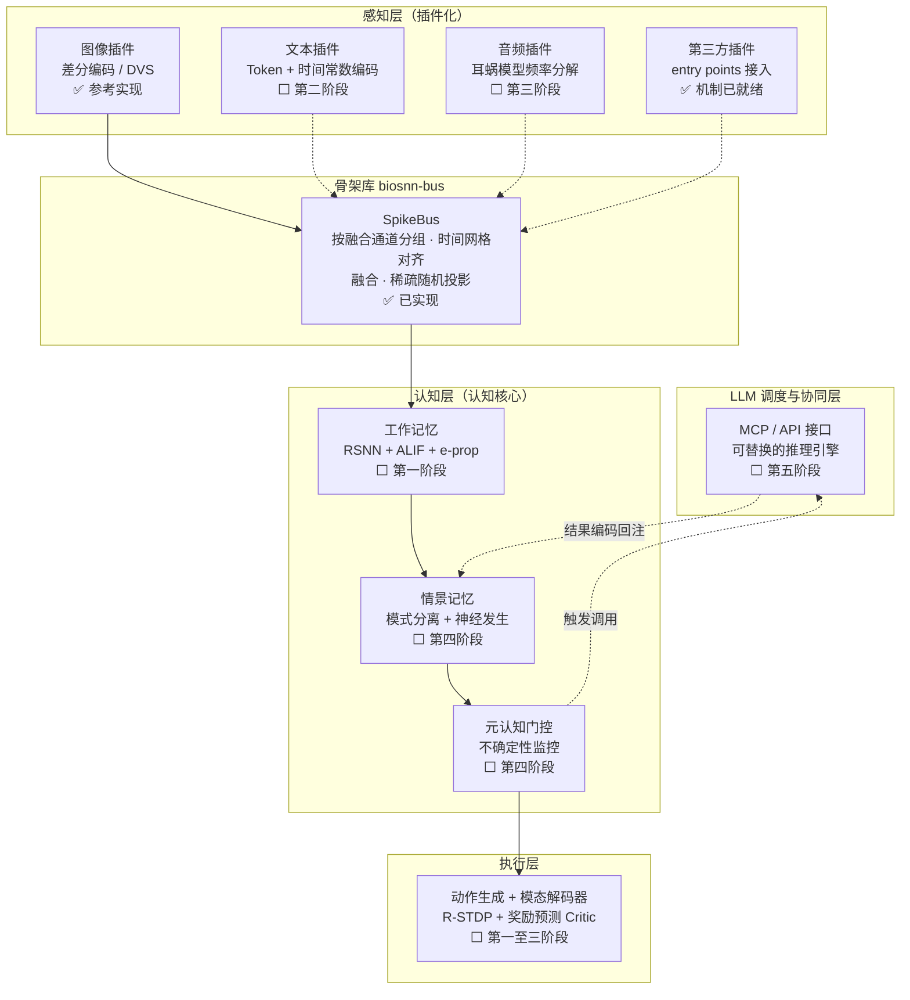

# BioSNN-Plug

**面向高生物合理性的全模态脉冲神经网络认知原型**

[English](README.en.md) · [项目计划书](BioSNN-Plug_项目计划书_v6.2.md) · [插件开发指南](docs/plugin_guide.md) · [架构决策记录](docs/adr/)

[](https://github.com/lzmd-arch/BioSNN-Plug/actions/workflows/ci.yml)
[](LICENSE)
[](https://www.python.org/downloads/)
[](https://colab.research.google.com/github/lzmd-arch/BioSNN-Plug/blob/main/examples/quickstart_register_plugin.ipynb)

---

## 这是什么

一个**研究原型**，探索一个具体的科学问题：

> **智能能否从纯局部学习规则中生长出来，并学会借助外部推理扩展自身的边界？**

具体说，它要验证三件事：

1. **完全跳过代理梯度**——所有突触更新由局部信号驱动（e-prop + 核化 IB-Hebbian +
   R-STDP），不依赖全局反向传播；
2. **模态插件化**——文本、图像、音频作为独立插件接入共享认知核心，新增模态不需要
   修改已有架构；
3. **SNN 自主调用 LLM**——SNN 作为认知主体决定"何时行动、关联什么"，LLM 只负责
   "选择行动类型并生成内容"，作为**可替换的推理引擎**置于 SNN 基质之内。

## 这不是什么

**不是生产框架。** 不追求 SOTA 性能，不承诺线上可用性，没有团队支持。

**不是"又一个多模态 SNN 库"。** 性能不是目标。项目的核心价值在于验证一条高风险
路线是否成立——计划书自己承认"这条路径的技术风险确实更高"。

**不是灵感的来源，是证据的来源。** 所有结论都要能在公开仓库里复现；核验不到的
引用会如实标成 `unverified`（见 [docs/references.md](docs/references.md)）。

## 当前状态

| 部分 | 状态 |
| :--- | :--- |
| `biosnn-bus` 骨架库 | **0.1.0 可用**——插件接口、注册与发现、脉冲总线骨架 |
| 研究代码（e-prop / IB-Hebbian / R-STDP） | **尚未开始**，第一阶段计划见[计划书 §七](BioSNN-Plug_项目计划书_v6.2.md) |
| 认知核心、LLM 协同模块 | 未开始 |

脉冲总线目前是**骨架**：双通道路由已经就位，但默认融合策略是平凡的拼接，
**不是**计划书 §2.2 描述的 TAAF 时间注意力引导融合——后者是第二阶段的研究任务。
详见 [ADR-0001](docs/adr/ADR-0001-skeleton-as-separate-library.md)。

## 架构

数据自下而上流动。图中 ✅ 是**当前仓库里已经能跑的东西**，⬜ 是计划书里尚未实现的
部分——这份图刻意把两者画在同一张图上，因为它同时是路线图。



每一层的学习规则都是**纯局部**的，不用代理梯度：感知层是核化 IB-Hebbian + 除法
归一化，认知层是 e-prop（Trace Propagation + ALIF），执行层是 R-STDP + Critic。
三层之间的冲突由 ES 元学习仲裁器调节。完整说明见
[项目计划书](BioSNN-Plug_项目计划书_v6.2.md) §2、§3。

## 快速开始

`biosnn-bus` 只依赖 numpy，无需 GPU：

```bash
pip install biosnn-bus
```

写一个模态插件就是实现三个方法和两个属性：

```python
import numpy as np

from biosnn_bus import ModalityPlugin, PassThroughMembrane, SpikeBus, SpikeTrain


class LevelEncoder(ModalityPlugin):
    """把一维信号按水平编码成群体脉冲。"""

    def __init__(self, spike_dim: int = 16) -> None:
        self._spike_dim = spike_dim
        self.levels = np.linspace(0.0, 1.0, spike_dim)

    @property
    def modality_name(self) -> str:
        return "level"

    @property
    def spike_dim(self) -> int:
        return self._spike_dim

    def encode(self, raw_input) -> SpikeTrain:
        signal = np.asarray(raw_input, dtype=np.float64).reshape(-1)
        radius = 0.5 / (self._spike_dim - 1)
        return SpikeTrain(data=np.abs(signal[:, None] - self.levels) <= radius)

    def get_membrane(self):
        return PassThroughMembrane()

    def decode(self, spike_output: SpikeTrain):
        return spike_output.data.astype(float) @ self.levels


bus = SpikeBus(bus_dim=64, seed=0)
bus.register(LevelEncoder())
output = bus.step({"level": np.linspace(0, 1, 12)})
print(output)
```

或者直接打开 [Colab 演示](https://colab.research.google.com/github/lzmd-arch/BioSNN-Plug/blob/main/examples/quickstart_register_plugin.ipynb)
（5 分钟，无 GPU），它会画出从插件到认知核心入口的完整脉冲栅格图。

想在**不改本仓库任何一行代码**的前提下让第三方包提供插件？见
[插件开发指南](docs/plugin_guide.md#让第三方包提供插件)。

## 仓库结构

```text
packages/biosnn-bus/   骨架库：独立分发包，遵循 semver，不依赖任何研究代码
research/              研究代码：第一阶段起填充，12 个月破坏性变更免责期
examples/              可跑的示例；脚本是唯一真相源，notebook 由它生成
docs/                  插件指南、ADR、复现清单、引用清单
scripts/               CI 与 pre-commit 用的检查脚本
```

## 关于维护

**单人维护。** 这一点写在最显眼的位置，因为管理预期比假装有团队更利于社区信任
（计划书 §12.5）。

- **issue 响应不设 SLA**。带完整复现步骤的报告会被优先处理；
- **骨架库 `biosnn-bus` 遵循 semver**，但当前是 `0.x`——按 semver 约定，
  `0.x` 的次版本号允许破坏性变更。第一个被外部依赖的版本会升到 `1.0.0`；
- **`research/` 下的代码前 12 个月（至 2027-09）不做任何兼容性承诺**；
- 第三方模态插件**不需要往本仓库提 PR**，独立成包即可（见
  [ADR-0003](docs/adr/ADR-0003-entry-point-plugin-discovery.md)）。

## 许可证

- 代码：[Apache-2.0](LICENSE)
- 文档与本计划书：[CC-BY 4.0](https://creativecommons.org/licenses/by/4.0/)
- 数据集：遵循各数据源许可。本仓库**不提供数据镜像**，只提供下载与预处理脚本。

## 引用

如果这个项目对你的研究有帮助，请引用 [CITATION.cff](CITATION.cff)。

对这个体量的项目，"被同行论文当作 baseline 或工具引用"是比 star 数更真实的成功
度量（计划书 §12.6）。
