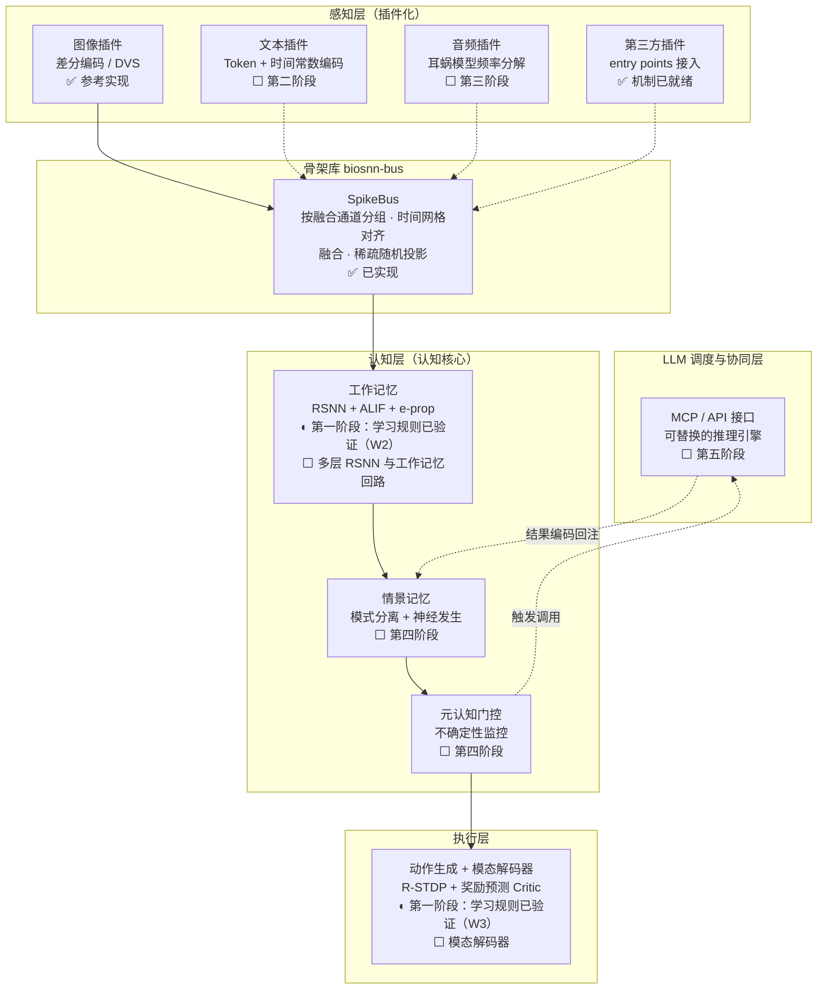

# BioSNN-Plug

**面向高生物合理性的全模态脉冲神经网络认知原型**

> Spiking neural networks (SNN) · biologically plausible local learning rules · no surrogate gradients · e-prop / Hebbian / R-STDP · neuromorphic computing · modality plugins · LLM orchestration

[English](README.en.md) · [项目计划书 v6.2](BioSNN-Plug_项目计划书_v6.2.md) · [v6.3（引用修订版）](BioSNN-Plug_项目计划书_v6.3.md) · [插件开发指南](docs/plugin_guide.md) · [架构决策记录](docs/adr/README.md)

> **两个版本的关系**：**v6.2 是正式计划书**；**v6.3** 把第一批引用考证的更正并了进去（改了哪些见 [`docs/references.md`](docs/references.md) 的「计划书正文待更正项」）。引用计划书时以 v6.2 为准；需要用到更正后的表述（例如 Trace Propagation 的定位、TD-LTP 的出处）时用 v6.3。

[](https://github.com/lzmd-arch/BioSNN-Plug/actions/workflows/ci.yml)
[](LICENSE)
[](https://www.python.org/downloads/)
[](https://colab.research.google.com/github/lzmd-arch/BioSNN-Plug/blob/main/examples/quickstart_register_plugin.ipynb)

## 这是什么

研究原型，验证一个问题：**智能能否从纯局部学习规则中生长出来，并学会借助外部推理扩展自身边界？**

三条具体主张：

1. **跳过代理梯度**——突触更新全部由局部信号驱动（感知层核化 IB-Hebbian、认知层 e-prop、执行层 R-STDP）；
2. **模态插件化**——文本/图像/音频作为独立插件接入共享认知核心，新增模态不改已有架构；
3. **SNN 自主调用 LLM**——SNN 是认知主体，决定"何时行动、关联什么"；LLM 作为可替换的推理引擎只负责"生成什么"。

## 这不是什么

**不是生产框架。** 不追求 SOTA，不承诺可用性，单人维护，issue 不设 SLA。

**不是通用 SNN 库。** 性能不是目标，价值在于验证一条高风险路线是否成立。

**是证据，不是灵感。** 结论要能在本仓库复现；核验不到的引用如实标 `unverified`（见[引用清单](docs/references.md)）。

## 和同类项目的关系

同类路线一眼对照。**每一格的依据、以及许可边界（哪个能进依赖、哪个一个字都不能抄），
在 [`docs/related_projects.md`](docs/related_projects.md)。**

| | 纯局部学习 | 多模态插件 | 自主触发 | 持续学习 | 开源框架 |
| :--- | :---: | :---: | :---: | :---: | :---: |
| **Javis** | ✅ 全是 STDP 家族，无反向传播（12 条可选） | ✗ | ✗ | ✗ | ◐ Rust，但**PolyForm 非商业** |
| **EMBER** | ◐ STDP + 资格痕迹 × 多巴胺门控 | ✗（仅文本） | ◐ 观察级，**N=1** | ✗ | ✗ 无公开仓库 |
| **MEMBRAIN** | ◐ Voja + PES | ✗ | ✗ | ◐ 自报与实现不符 | ✅ Nengo（MIT） |
| **eprop-PyTorch / ESPP** | ✅ e-prop；ESPP 是另一条并列规则 | ✗ | ✗ | ✗ | ◐ 代码片段，非框架 |
| **BioSNN-Plug**（本项目） | ✅ 三条线全部验收 | ◐ 骨架已发布；插件有图像一路 | ○ 第五阶段 | ○ 第三阶段 | ✅ `biosnn-bus` 已上 PyPI |

图例：**✅ 已实现并有验收数据** · **◐ 部分**（机制或证据不全） · **○ 只在路线图里（计划书有任务，未开始）** · **✗ 无**

⚠️ **本表最后一行有两格是 ○ 而不是 ✅**——「自主触发」排在第五阶段、「持续学习」排在第三阶段，
两者的实现都**尚未开始**。把符号分开写，就是为了不让这张表读起来像我们已经做到了。

## 当前状态

| 部分 | 状态 |
| :--- | :--- |
| `biosnn-bus` 骨架库 | **0.1.0 可用**——插件接口、注册与发现、脉冲总线骨架 |
| 研究代码：三条验证线 | **第一阶段实现完成**——W1 Hebbian 感知 MNIST **97.79%**（默认闭式解读出；SGD 读出 98.01%）✓；W2 e-prop 序列 sMNIST **77.48%**（活跃神经元 1.0000）✓；W3 R-STDP CartPole 中位数 **237.8 步**（阈值 ≥ 200）✓。数字与复现记录见[复现记录](docs/reproducibility.md) |
| **网络规模** | **256 个脉冲神经元**（W2）；W1 另有 3,072 个**速率型**单元（不算脉冲神经元）。计划书 §2.2 的认知核心目标是约 5 万——**差约 195 倍**，详见 [research/README](research/README.md) |
| 认知核心 / LLM 协同 | **未开始**，见[计划书 §七](BioSNN-Plug_项目计划书_v6.2.md) |

两处需要说清楚的边界：

- 脉冲总线是**骨架**：双通道路由已就位，但默认融合策略是平凡拼接，**不是**计划书 §2.2 描述的 TAAF 时间注意力引导融合——那是第二阶段的研究任务。（骨架库为何独立成包、
为何刻意不包含这些东西，见 [ADR-0001](docs/adr/ADR-0001-skeleton-as-separate-library.md)。）
- 骨架库**已发布到 PyPI**：`pip install biosnn-bus`（当前 `0.1.0`）。发布走 PyPI trusted publishing（OIDC，不存 token），流程见 [release.yml](.github/workflows/release.yml)。

## 架构

数据自下而上流动。✅ 是当前仓库里已经能跑的；◐ 是**该层的单条学习规则已在第一阶段验证**、模块整体仍未实现（多层网络、模态解码器、工作记忆回路等）；⬜ 是计划书里尚未开始实现的。画在同一张图上，因为这张图同时是路线图。



层间冲突由 **ES 元学习仲裁器**调节（⬜ 第二阶段）。各层学习规则的完整说明见[计划书](BioSNN-Plug_项目计划书_v6.2.md) §2、§3。

## 快速开始

只依赖 numpy，无需 GPU：

```bash
pip install "biosnn-bus @ git+https://github.com/lzmd-arch/BioSNN-Plug.git#subdirectory=packages/biosnn-bus"
```

一个模态插件就是三个方法加两个属性：

```python
import numpy as np

from biosnn_bus import ModalityPlugin, PassThroughMembrane, SpikeBus, SpikeTrain


class LevelEncoder(ModalityPlugin):
    """把一维信号按水平编码成群体脉冲。"""

    def __init__(self, spike_dim: int = 16) -> None:
        self._spike_dim = spike_dim
        self.levels = np.linspace(0.0, 1.0, spike_dim)

    @property
    def modality_name(self) -> str:
        return "level"

    @property
    def spike_dim(self) -> int:
        return self._spike_dim

    def encode(self, raw_input) -> SpikeTrain:
        signal = np.asarray(raw_input, dtype=np.float64).reshape(-1)
        radius = 0.5 / (self._spike_dim - 1)
        return SpikeTrain(data=np.abs(signal[:, None] - self.levels) <= radius)

    def get_membrane(self):
        return PassThroughMembrane()

    def decode(self, spike_output: SpikeTrain):
        return spike_output.data.astype(float) @ self.levels


bus = SpikeBus(bus_dim=64, seed=0)
bus.register(LevelEncoder())
output = bus.step({"level": np.linspace(0, 1, 12)})
print(output)
```

[Colab 演示](https://colab.research.google.com/github/lzmd-arch/BioSNN-Plug/blob/main/examples/quickstart_register_plugin.ipynb)（5 分钟，无 GPU）会画出从插件到认知核心入口的完整脉冲栅格图。

想让第三方包提供插件？**不需要改本仓库任何一行代码**，见[插件开发指南](docs/plugin_guide.md#让第三方包提供插件)。

## 仓库结构

```text
packages/biosnn-bus/   骨架库：独立分发包，遵循 semver，不依赖任何研究代码
research/              研究代码：第一阶段起填充，12 个月破坏性变更免责期
examples/              可跑的示例；脚本是唯一真相源，notebook 由它生成
docs/                  插件指南、ADR、复现清单、引用清单
scripts/               CI 与 pre-commit 用的检查脚本
```

## 维护预期

单人维护，带完整复现步骤的报告优先处理。

- `biosnn-bus` 遵循 semver，当前 `0.x`——按约定次版本号允许破坏性变更，第一个被外部依赖的版本升到 `1.0.0`；
- `research/` 下的代码前 12 个月（至 2027-09）不做兼容性承诺；
- 第三方模态插件独立成包即可，不需要往本仓库提 PR（[ADR-0003](docs/adr/ADR-0003-entry-point-plugin-discovery.md)）。

## 许可证与引用

代码 [Apache-2.0](LICENSE)，文档与计划书 [CC-BY 4.0](https://creativecommons.org/licenses/by/4.0/)。数据集遵循各数据源许可，本仓库不提供数据镜像；下载与预处理脚本是 [scripts/download_data.py](scripts/download_data.py)。

研究线依赖的 **SpikingJelly 用的是启智开源许可证 1.0（OIOSL），不是 Apache-2.0**。研究用途不触发它，但**商业使用或再发布须自行向 AITISA 声明披露**。取舍与它对 Python 下限的影响见 [ADR-0008](docs/adr/ADR-0008-spikingjelly-license-and-python-floor.md)。

引用请用 [CITATION.cff](CITATION.cff)。
