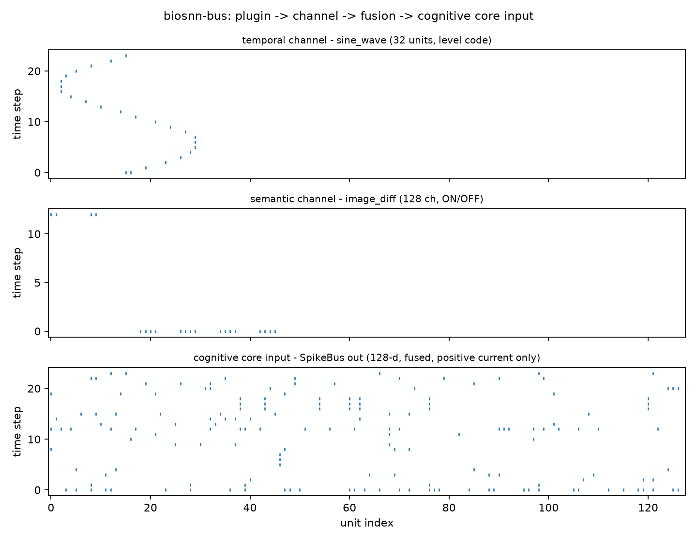

# biosnn-bus

[中文](README.md) · [English](README.en.md)

[BioSNN-Plug](https://github.com/lzmd-arch/BioSNN-Plug) の**モダリティプラグインスケルトンライブラリ**です。

担うのはただ一つ：**新しいモダリティを追加するときに、既存のアーキテクチャを変更しなくてよいようにすること**です。

> **これはスケルトンであり、認知コアではありません。** 本ライブラリにはいかなる学習則
> （e-prop / R-STDP / カーネル化 IB-Hebbian）も含まれず、スパイクニューロンモデルも
> 含まれません。GPU にも依存せず、PyTorch にも依存しません。提供するのは、プラグインの
> インターフェースコントラクト、登録と発見のメカニズム、そしてスパイクバスの継ぎ目です。

## インストール

```bash
pip install biosnn-bus

# torch ブリッジが必要なとき（SpikeTrain.to_torch / from_torch）
pip install "biosnn-bus[torch]"
```

`main` ブランチの**未リリース**の変更（レビュー中の修正など）を入れる場合は Git から：

```bash
pip install "biosnn-bus @ git+https://github.com/lzmd-arch/BioSNN-Plug.git#subdirectory=packages/biosnn-bus"
```

依存するのは numpy だけです。

## クイックスタート

```python
import numpy as np
from biosnn_bus import ModalityPlugin, PassThroughMembrane, SpikeBus, SpikeTrain


class MyPlugin(ModalityPlugin):
    @property
    def modality_name(self) -> str:
        return "my_modality"

    @property
    def spike_dim(self) -> int:
        return 64

    def encode(self, raw_input):
        return SpikeTrain(data=np.asarray(raw_input) > 0.5, channel=self.channel)

    def get_membrane(self):
        return PassThroughMembrane()

    def decode(self, spike_output):
        return spike_output.rates


bus = SpikeBus(bus_dim=128, seed=0)
bus.register(MyPlugin())
out = bus.step({"my_modality": np.random.default_rng(0).random((10, 64))})
print(out)
```

完全に実行できる版は [`examples/quickstart_register_plugin.py`](https://github.com/lzmd-arch/BioSNN-Plug/blob/main/examples/quickstart_register_plugin.py)、
および [Colab notebook](https://colab.research.google.com/github/lzmd-arch/BioSNN-Plug/blob/main/examples/quickstart_register_plugin.ja.ipynb)（GPU なしで実行できます）にあります。

実行すると下の図が出ます——1 次元の正弦信号が時間チャネル（32 ユニットのレベル符号化）、8×8 の
輝度変化列が意味チャネル（128 チャネル、ON/OFF）を通り、最下段が融合と射影のあとに
**実際に認知コアへ送られる入力**です：



図中のラベルが英語なのは、既定のフォントに CJK 字形がなく、日本語ラベルが豆腐（□）になるためです。
図の**真実の源はただ一つ**——[`scripts/make_figures.py`](../../scripts/make_figures.py) が上の例を
再実行し、例自身が PNG を書き出します（描画コードを別に持たない）。論文用の図 F1 です。

## 中核となる概念

| 概念 | 説明 |
| :--- | :--- |
| `ModalityPlugin` | モダリティプラグインの抽象基底クラスです。`encode` / `decode` / `get_membrane` の 3 メソッドと、`modality_name` / `spike_dim` の 2 プロパティを持ちます |
| `SpikeTrain` | 形状 `(T, N)` のスパイク列コンテナです。ブール値（スパイク）でも浮動小数点（発火率）でも保持できます |
| `FusionChannel` | `temporal` / `semantic` の 2 本の融合チャネルです。プロジェクト計画書 §2.2 の「二重チャネル融合」に対応します |
| `SpikeBus` | スパイクバスです。符号化 → 時間整列 → チャネルごとの融合 → 認知コア次元へのスパースランダム射影、という流れです |
| `register_plugin` | プロセス内登録デコレータです |
| `discover_plugins` | サードパーティの配布パッケージが宣言したエントリポイントをスキャンします |

## サードパーティプラグインの組み込み方

自分のパッケージでエントリポイントを宣言します。**BioSNN-Plug のコードを一行も変更する必要はありません**：

```toml
# 自分のパッケージの pyproject.toml
[project.entry-points."biosnn_bus.plugins"]
audio = "my_pkg.plugins.audio:AudioPlugin"
```

利用者側がそれをスキャンして組み込みます。次のコードはそのまま実行できます——サードパーティプラグインが一つもインストールされていなくても：

```python
from biosnn_bus import SpikeBus, discover_plugins, get_plugin, list_plugins
from biosnn_bus.plugins import DiffImagePlugin

discover_plugins()  # サードパーティの配布パッケージが宣言したプラグインをスキャンします。一つもインストールされていなくてもエラーになりません
print(list_plugins())  # 組み込みのサンプルプラグインは import 時にレジストリへ登録済みです

bus = SpikeBus(bus_dim=128, seed=0)
bus.register(get_plugin("image_diff")())  # bus.register(DiffImagePlugin()) と等価です
print(bus)
```

## スケルトンの境界

スパイクバスの現在の既定の融合戦略は**単純連結**（`ConcatenateFusion`）であり、
プロジェクト計画書 §2.2 が記述する TAAF 時間注意誘導融合では**ありません**——後者は
第 2 フェーズの研究タスクです。バスにはすでに `FusionStrategy` プロトコルと二重チャネルルーティングが
用意されており、戦略を差し替えても呼び出し側のコードは変わりません。

理由は [ADR-0001](https://github.com/lzmd-arch/BioSNN-Plug/blob/main/docs/adr/ADR-0001-skeleton-as-separate-library.ja.md) を参照してください。

## ライセンス

Apache-2.0。ドキュメントは CC-BY 4.0 を採用しています。
